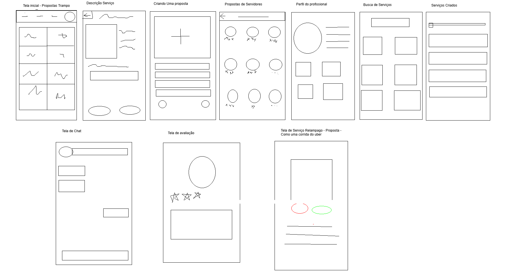
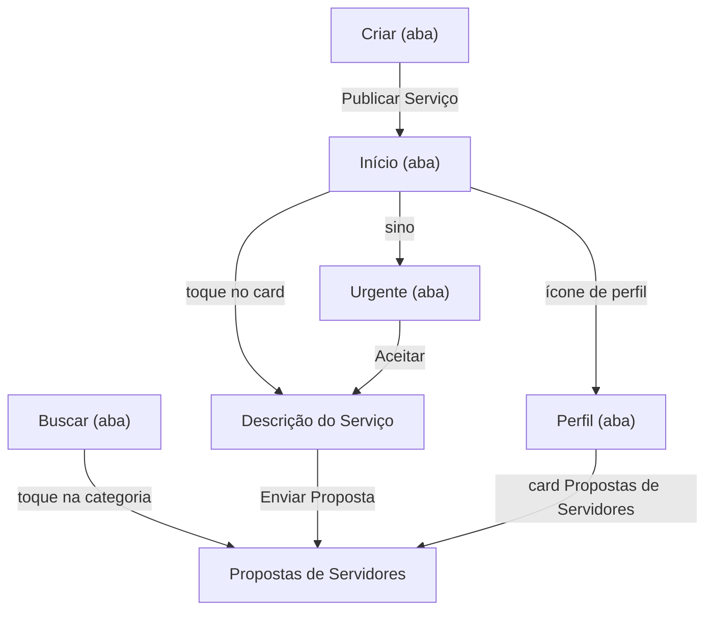
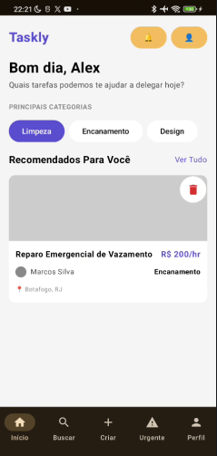
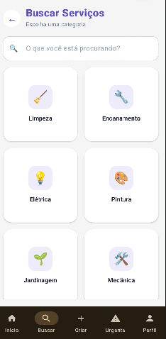
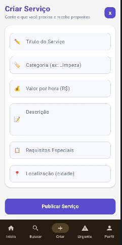
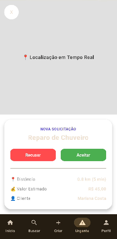
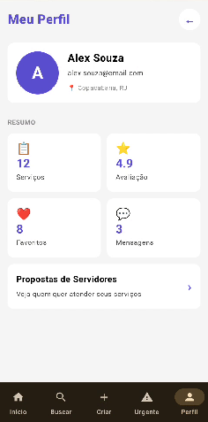
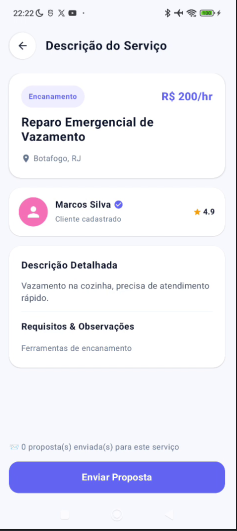
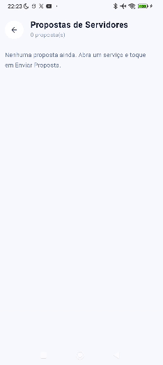
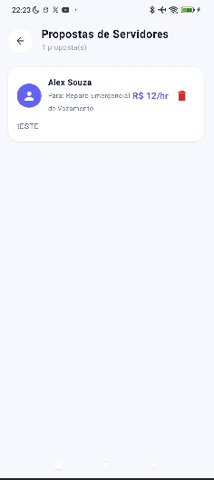

# Trampai (Taskly): processo e decisões do Trabalho 2

O **Trampai** (o nome que aparece na tela é *Taskly*) é um app Android feito em Jetpack Compose que liga quem precisa de um serviço, como limpeza, encanamento ou pintura, a quem pode fazê-lo. O cliente publica o serviço, os profissionais respondem com propostas e o cliente compara as ofertas.

Neste documento contamos como saímos do protótipo do Trabalho 1 até a versão atual: o que o app faz, quais telas existem, como organizamos os dados e o código, onde está a parte mais elaborada e o que ainda queremos melhorar.

---

## Vídeos

| Vídeo | O que mostra |
|---|---|
| [Versão 1 do app](materiaisProgesso/VERSAO1PROJETO.mp4) | Como o projeto estava no Trabalho 1 |
| [Planos da versão 2](materiaisProgesso/V2_PLANOS.mp4) | O que planejamos mudar e as escolhas que fizemos |
| [Planos finais da versão 2](materiaisProgesso/V2_PLANOS_FINAIS.mp4) | O que decidimos construir no fim |

> Se o vídeo não abrir direto no navegador, é só baixar o arquivo.

---

## 1. O que o app faz hoje

### O que já funciona

- **Publicar um serviço.** Na aba *Criar*, o formulário pede título, categoria, valor por hora, descrição, requisitos e localização. Ele valida o que foi digitado e avisa se faltar algo.
- **Ver os serviços publicados.** A aba *Início* mostra uma lista de cards. O serviço novo aparece no topo.
- **Remover um serviço.** Basta segurar o card (clique longo). As propostas daquele serviço somem junto, para não sobrar proposta sem serviço.
- **Abrir o detalhe de um serviço.** Ao tocar no card, a tela de Descrição mostra os dados do serviço que foi tocado, e não de outro.
- **Enviar uma proposta.** Na Descrição, o botão *Enviar Proposta* abre um formulário com o valor por hora e uma mensagem. Ao enviar, o app leva para a lista de propostas.
- **Comparar propostas.** Cada proposta mostra para qual serviço ela é, quem pediu o serviço, a hora do envio e se o valor está abaixo ou acima do que o serviço pede.
- **Remover uma proposta.** Também com clique longo.
- **Buscar categorias.** Na aba *Buscar*, o campo de texto filtra as categorias enquanto se digita.
- **Navegar.** Uma barra inferior com 5 abas (Início, Buscar, Criar, Urgente e Perfil), mais botões de voltar nas telas que abrem por cima.

### O que ainda é demonstrativo

Algumas telas já têm o visual pronto, mas com dados de exemplo:

- **Perfil:** nome, e-mail e os números do resumo são fixos.
- **Urgente:** a solicitação e o mapa são simulados.
- **Avaliação das pessoas:** a nota exibida é fixa.
- **Categorias:** tocar numa categoria abre a lista de propostas, ainda sem filtrar por categoria.

### Melhorias futuras

- Guardar os dados de forma que sobrevivam ao fechar o app (por exemplo, com Room).
- Ter contas de usuário, com login, para separar quem pede de quem atende.
- Uma tela própria para cada proposta, com botões para aceitar ou recusar.
- Mostrar no Perfil o serviço que está em andamento depois que uma proposta for aceita.
- Editar um serviço depois de publicado.
- Fazer a busca por categoria listar de verdade os serviços e profissionais daquela categoria.
- Ligar a tela Urgente a dados reais e a um mapa de verdade.
- Perfil com dados reais do usuário e avaliações.
- Fotos e anexos nos serviços.

---

## 2. As telas do aplicativo

Antes de programar, desenhamos um esboço das telas. As anotações do planejamento estão em [IdeiaTelas.txt](materiaisProgesso/IdeiaTelas.txt) e [TelasEscolhidasCanva.txt](materiaisProgesso/TelasEscolhidasCanva.txt).



O app tem **7 telas**. Cinco delas ficam na barra inferior (as abas) e duas abrem por cima, em tela cheia.



### Abas (barra inferior)

**Início.** A lista de serviços publicados. É o ponto de partida, onde o usuário vê rápido as demandas ativas.



**Buscar.** Categorias de serviço com um campo de busca que filtra enquanto o usuário digita.



**Criar.** O formulário para publicar um novo serviço, com validação dos campos.



**Urgente.** A tela de chamados emergenciais: o profissional vê a solicitação e escolhe entre recusar e aceitar.



**Perfil.** Dados do usuário, um resumo em cards e o atalho para as propostas.



### Telas abertas por cima (sem a barra inferior)

**Descrição do Serviço.** Os detalhes completos do serviço escolhido, com o botão para enviar uma proposta.



**Propostas de Servidores.** A lista das propostas enviadas, com a comparação de valores. Abaixo, a tela com propostas e uma segunda captura.

 

---

## 3. Por que escolhemos as telas novas

O Trabalho 1 já tinha o começo do app (Início, Buscar, Criar e Urgente). Para o Trabalho 2 acrescentamos três telas, cada uma com um motivo.

**Propostas de Servidores.** Um serviço publicado só vira negócio quando alguém responde a ele. Sem esta tela, o app terminava no momento em que o cliente publicava o serviço. Ela é a segunda lista do trabalho e fecha o caminho: publicar, receber propostas, comparar.

**Descrição do Serviço.** O card da Início é um resumo; o cliente e o profissional precisam de um lugar para ver o serviço por inteiro. Também é nela que o profissional age: é de lá que sai a proposta. Por isso a escolhemos para mostrar a passagem de dados por rota.

**Meu Perfil.** Todo app com contas tem um lugar do usuário, e ele nos deu um ponto de entrada natural para a lista de propostas: o cliente abre o Perfil e vê as propostas que recebeu. Hoje ele mostra dados de exemplo, mas já está no lugar certo do fluxo, pronto para receber dados reais quando houver login.

---

## 4. As duas data classes

O app trabalha com dois tipos de item, e um depende do outro.

**`Servico`** é o pedido que o cliente publica.

```kotlin
data class Servico(
    val id: Int,
    val titulo: String,
    val categoria: String,
    val valorHora: Double,
    val descricao: String,
    val requisitos: String,
    val localizacao: String,
    val autor: String        // quem pediu o serviço (o requerente)
)
```

**`Proposta`** é a resposta de um profissional a um serviço.

```kotlin
data class Proposta(
    val id: Int,
    val servicoId: Int,         // liga a proposta ao serviço dela
    val servicoTitulo: String,
    val profissional: String,
    val valorHora: Double,
    val mensagem: String,
    val hora: String,           // preenchida na hora do envio
    val valorServico: Double,   // valor pedido pelo serviço, copiado na hora do envio
    val requerente: String      // quem pediu o serviço, copiado na hora do envio
)
```

Como elas se relacionam e por que as desenhamos assim:

- **O elo é o `servicoId`.** Cada proposta guarda o id do serviço a que pertence. É por ele que a Descrição conta quantas propostas o serviço recebeu.
- **Alguns campos são preenchidos sozinhos.** O usuário só digita o valor e a mensagem. A hora, o valor pedido e o requerente são gravados pelo `MeuViewModel` no momento em que a proposta é enviada. Assim a tela de propostas não precisa procurar nada na outra lista: já recebe tudo pronto.
- **Há valores calculados dentro da própria classe.** `valorFormatado` transforma `120.0` em `R$ 120/hr`, e `diferenca` e `textoDiferenca` comparam o valor da proposta com o valor pedido.
- **Remover um serviço remove as propostas dele.** Evita proposta "órfã", que apontaria para um serviço que não existe mais.

As duas listas ficam no `MeuViewModel` como `mutableStateListOf`. Quando algo é adicionado ou removido, as telas que leem a lista se atualizam sozinhas.

---

## 5. A parte que vai além de exibir dados

O enunciado pedia que alguma tela fizesse mais do que reexibir os campos de um item. Fizemos isso em duas partes que trabalham juntas, e o que construímos por último foi a segunda.

### Na Descrição do Serviço

- A tela recebe só o **id** pela rota (`descricao/{servicoId}`) e busca o serviço no ViewModel.
- Ela mostra "N proposta(s) enviada(s) para este serviço". Esse número não está guardado em lugar nenhum: é **calculado** contando, na lista de propostas, as que têm o `servicoId` daquele serviço. Ou seja, ela cruza as duas listas.
- Ela abre um formulário de proposta e devolve a nova proposta ao ViewModel.

### No card de cada proposta (a última parte que fizemos)

O cliente que recebe várias propostas quer saber logo qual compensa. Então cada card responde isso sem precisar abrir outra tela:

- **De qual serviço é**, no texto "Para: ...".
- **Quanto o valor está abaixo ou acima do pedido**, numa etiqueta colorida: verde quando é mais barata, laranja quando é mais cara, cinza quando é igual.
- **Quem pediu o serviço** (o requerente) e **a hora do envio**.

Um exemplo concreto: um serviço pede R$ 120/hr, e um profissional manda proposta de R$ 90/hr. O card mostra **"R$ 30/hr abaixo do pedido"**, em verde. O cálculo é uma subtração entre o valor da proposta e o valor pedido, guardado na proposta no momento do envio.

**Por que escolhemos isso.** Mostrar o serviço e o requerente já é cruzar as duas listas, e a diferença de valor é uma informação nova, que nenhum dos dois itens traz sozinho. Também é a parte do app que mais se parece com o problema real do usuário: decidir entre ofertas.

---

## 6. Do começo até agora

| | Trabalho 1 | Trabalho 2 |
|---|---|---|
| **Trocar de tela** | Uma variável de estado na `MainActivity` e um `when` escolhendo a tela | `NavHost` com rotas nomeadas, barra inferior e passagem de id por rota |
| **Dados** | Cards com textos escritos direto no código | Listas reativas (`mutableStateListOf`) no ViewModel |
| **Formulário de criar** | Campos desenhados, que não aceitavam digitação | `OutlinedTextField` com estado, validação e mensagem de erro |
| **Botões** | Vários sem ação (sino, categorias, "Ver Tudo", "Aceitar") | Todos levam a algum lugar |
| **Remover itens** | Não existia | Clique longo com aviso na tela |
| **Tipos de item** | Nenhum modelo de dados | `Servico` e `Proposta`, ligados por `servicoId` |
| **Ícones** | Emojis escritos como texto | `Icon` do Material |
| **Cores** | Textos sem cor definida, que sumiam no modo escuro | Cores definidas em cada tela |
| **Nomes** | `Tela1`, `Tela2`, `TelaUm`, `TelaDois`... | Nomes que dizem o que a tela é (`TelaHome`, `TelaCriarServico`...) |
| **Telas** | 4 | 7 |

Para ver a diferença em movimento, compare o [vídeo da versão 1](materiaisProgesso/VERSAO1PROJETO.mp4) com os [planos finais da versão 2](materiaisProgesso/V2_PLANOS_FINAIS.mp4).

---

## 7. Como organizamos o código

- **Rotas num lugar só.** O objeto `Rotas` guarda todas as rotas como `const val`, e funções como `Rotas.descricao(id)` montam a rota com o argumento. Assim não há texto solto espalhado pelo projeto.
- **Dois `NavHost`, um dentro do outro.** O de fora (`AppNavigation`) cuida das telas que abrem por cima. O de dentro, na tela que guarda as abas (`MinhaTela`), cuida da barra inferior. Foi o jeito de a barra aparecer só nas abas e sumir na Descrição e nas Propostas.
- **Uma regra para não errar o controlador.** Para ir de uma aba para outra, usamos o controlador de dentro (`navInterno`). Para abrir uma tela por cima, usamos o de fora (`navController`).
- **Um único ViewModel.** `MeuViewModel` guarda as duas listas e as operações de adicionar, remover e buscar por id. As telas só mostram o que recebem e avisam quando o usuário fez algo.
- **Telas sem dependência do `NavController`.** Cada tela recebe funções (`aoRemover`, `irParaBusca`...) em vez do controlador. Isso deixa as telas mais simples e fáceis de testar sozinhas.

---

## 8. Dificuldades e como resolvemos

- **Navegação.** A maior dificuldade foi fazer o `Navigation` funcionar entre todas as telas. Tivemos que entender como o `NavHost` funciona, como passar um argumento pela rota e como manter a barra inferior só nas abas. Resolvemos separando em dois `NavHost` e criando a regra do controlador certo para cada tipo de navegação.
- **Textos que sumiam.** No celular em modo escuro, vários textos ficavam quase invisíveis, porque não tinham cor definida. Passamos a definir a cor de cada texto.
- **Nomes de arquivos e funções.** Com `Tela1`, `Tela2`, `TelaUm` e `TelaDois`, ninguém achava o arquivo certo. Renomeamos tudo para nomes que dizem o que a tela faz.
- **Pacotes e imports.** Depois de mover arquivos para a pasta `navigation`, vários nomes ficaram "não encontrados" até acertarmos os imports.
- **Botões sem função.** O enunciado pede que todo botão tenha propósito. Revisamos o app inteiro e ligamos cada um a uma ação real.


## 🎬 Vídeos Demonstrativos

Abaixo estão os registros em vídeo que mostram a evolução do nosso aplicativo, desde a primeira versão até a entrega final. *(Se os vídeos não carregarem diretamente no visualizador, você pode baixar os arquivos locais para assistir).*

### 1. Versão 1 do App
Como o projeto estava estruturado no início, durante a entrega do Trabalho 1.

<video controls src="materiaisProgesso/VERSAO1PROJETO.mp4" title="Versão 1 do App" width="400"></video>

### 2. Planos da Versão 2
O que planejamos mudar, as novas funcionalidades pensadas e as escolhas iniciais que fizemos para melhorar a arquitetura do aplicativo.

<video controls src="materiaisProgesso/V2_PLANOS.mp4" title="Planos da Versão 2" width="400"></video>

### 3. Planos Finais da Versão 2
O que decidimos construir no fim, alinhando as expectativas iniciais com a implementação técnica real do projeto.

<video controls src="materiaisProgesso/V2_PLANOS_FINAIS.mp4" title="Planos Finais da Versão 2" width="400"></video>

### 4. Aplicativo Entregue (Versão Atual)
A demonstração do aplicativo em sua versão final.

<video controls src="materiaisProgesso/AppEntregue.mp4" title="Aplicativo Entregue" width="400"></video>
