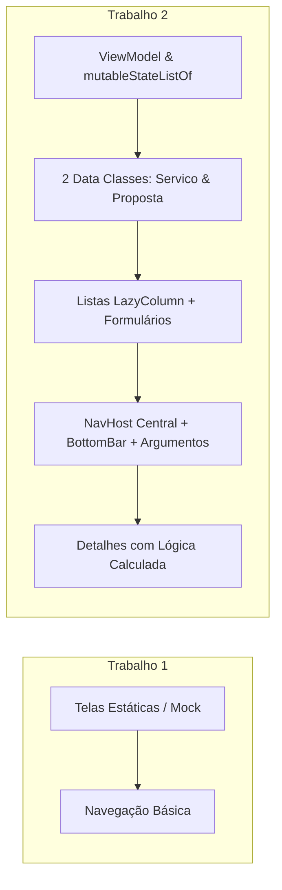

# 📜 PROCESSO.md — Documentação, Histórico e Decisões do Projeto (Trampai)

Este documento detalha o processo de desenvolvimento do aplicativo **Trampai (Taskly)**, respondendo às diretrizes da **Seção 4** da especificação do trabalho (Histórico de decisões, Antes x Depois, Telas novas, Arquitetura, Complexidade extra e Resolução de dificuldades).

---

## 1. Como estava o projeto no Trabalho 1, e o que mudou para chegar até aqui? (ANTES x DEPOIS)

| Critério / Aspecto | Trabalho 1 (Versão Anterior) | Trabalho 2 (Versão Atual) |
| :--- | :--- | :--- |
| **Estado dos Dados** | Estático, mockado em variáveis fixas (val) ou sem reatividade. | Totalmente reativo utilizando `mutableStateListOf` dentro de um `ViewModel` centralizado. |
| **Modelos de Dados** | Apenas 1 tipo de item genérico. | **2 Data Classes distintas:** `Servico` e `Proposta`, permitindo relacionamento lógico entre entidades. |
| **Listas & Exibição** | Listagens simples ou estáticas sem interatividade real. | Duas telas de lista completas utilizando `LazyColumn` + `Card`, com suporte a exclusão em tempo real. |
| **Entrada de Dados (Formulários)** | Apenas visualização, sem campos de cadastro funcionais. | Formulários interativos com `OutlinedTextField`, validação de preenchimento e botão de cadastro funcional. |
| **Navegação** | Apenas troca simples de telas sem parâmetros. | **NavHost** robusto com objeto `Rotas`, passagem de argumentos por rota (`servicoId`) e `BottomNavigation` (`NavigationBar`) funcional mantendo o estado das abas. |
| **Telas de Detalhes** | Inexistente ou apenas exibia texto estático. | **2 Telas de Detalhes/Gestão**, sendo que a principal (`TelaDescricaoServico`) realiza cálculos dinâmicos e combina dados das duas listas. |

---

## 2. Por que essas telas novas? O que cada uma faz e por que o trio escolheu?

O aplicativo foi expandido para **7 telas navegáveis**, escolhidas para refletir o ecossistema real de um conector de serviços (Cliente x Prestador):

1. **Aba Início (`TelaHome` - Lista 1):** Exibe a lista reativa de serviços disponíveis. Escolhida para ser o ponto central onde o usuário visualiza rapidamente as demandas ativas.
2. **Aba Buscar (`TelaBuscaServicos`):** Permite filtrar serviços por categoria. Essencial para a usabilidade em aplicativos de prestação de serviços.
3. **Aba Criar (`TelaCriarServico`):** O formulário interativo de cadastro de novos serviços. Escolhida para cumprir a exigência de adicionar itens dinamicamente pela UI.
4. **Aba Urgente (`TelaServicoRelampago`):** Simula chamados emergenciais em tempo real.
5. **Aba Perfil (`TelaPerfil`):** Centraliza os dados do usuário logado e oferece atalhos para gerenciar propostas.
6. **Tela de Descrição do Serviço (`TelaDescricaoServico` - Detalhe 1):** Aberta ao clicar em um serviço da lista (passando o ID por argumento de rota). Mostra todos os detalhes e permite enviar propostas.
7. **Tela de Propostas de Servidores (`TelaPropostasServidores` - Lista 2 e Gestão):** Lista os orçamentos/propostas enviadas para os serviços, permitindo remover propostas cadastradas.

---

## 3. Que decisão de configuração/organização do código o trio tomou, e por quê?

* **Organização das Rotas (`Rotas.kt`):** Criamos um objeto central `Rotas` com constantes `const val` para evitar erros de digitação de strings nas navegações e incluímos funções auxiliares (como `Rotas.descricao(id)`) para injetar parâmetros de rota de forma limpa.
* **NavHost Aninhado (`AppNavigation` vs. `MinhaTela`):** 
  * O `AppNavigation` gerencia as telas de nível superior (como a Tela de Detalhes e a Tela de Propostas).
  * O `MinhaTela` gerencia um `NavHost` interno dedicado exclusivamente às abas da barra inferior (`BottomBarNav`), garantindo que o usuário navegue entre Início, Busca, Criar, Urgente e Perfil sem perder o estado das telas ao alternar entre as abas.
* **Gerenciamento de Estado (`MeuViewModel`):** Optamos por centralizar a lista reativa (`mutableStateListOf<Servico>` e `mutableStateListOf<Proposta>`) em um `ViewModel` dedicado para desacoplar a lógica de negócio e o estado da interface visual.

---

## 4. Qual foi a complexidade extra que o trio colocou na tela de Detalhes, e por quê?

Para atender ao requisito avançado da Seção 3.2 (fazer mais do que apenas reexibir campos), a **`TelaDescricaoServico`** executa as seguintes operações avançadas:
1. **Consulta Relacional em Tempo Real:** A tela recebe o ID do serviço via argumento de rota, busca o item correspondente na lista do `ViewModel` e calcula em tempo real quantas propostas foram enviadas especificamente para aquele serviço (`qtdPropostas`).
2. **Ação Interativa / Subfluxo:** Ao tocar em "Enviar Proposta", um diálogo interativo é aberto permitindo ao usuário informar o valor por hora e uma mensagem. Ao confirmar, uma nova `Proposta` é criada, vinculada ao `servicoId`, e adicionada à segunda lista reativa do app, navegando automaticamente para a tela de gerenciamento de propostas.

---

## 5. Algum integrante teve dificuldade em algum ponto? Como resolveram?

* **Dificuldade 1:** Passagem de parâmetros numéricos (`Int`) via rota no Compose Navigation e recuperação segura no destino (`arguments?.getInt("servicoId")`).
  * **Resolução:** Estudamos a documentação do Navigation Compose e implementamos a tipagem correta (`type = NavType.IntType`) combinada com uma função helper `Rotas.descricao(id)` no objeto `Rotas`.
* **Dificuldade 2:** Conflito entre a barra de navegação inferior (`BottomBar`) e as telas de detalhe em tela cheia.
  * **Resolução:** Adotamos a arquitetura de **NavHost Aninhado**, onde o `Scaffold` com a barra inferior fica restrito apenas ao container das abas, permitindo que as telas de detalhes ocupem a tela inteira sem sobreposições indesejadas.

---

## 📸 Evidências Visuais e Prints do App Funcionando

> *Nota para a avaliação:* Conforme exigido na Seção 4, certifique-se de capturar prints do app em execução nos seguintes estados e salvá-los na pasta de documentação do repositório (ex: `docs/images/`):
> 1. `print_home_lista.png` — Tela Inicial (`TelaHome`) exibindo a lista de serviços com `LazyColumn` e `Card`.
> 2. `print_criar_servico.png` — Tela de formulário (`TelaCriarServico`) com campos preenchidos.
> 3. `print_detalhes_servico.png` — Tela de Detalhes (`TelaDescricaoServico`) mostrando o cálculo de propostas.
> 4. `print_propostas.png` — Tela de Lista de Propostas (`TelaPropostasServidores`).
> 5. `print_bottom_bar.png` — Navegação pelas abas inferiores (`NavigationBar`).

